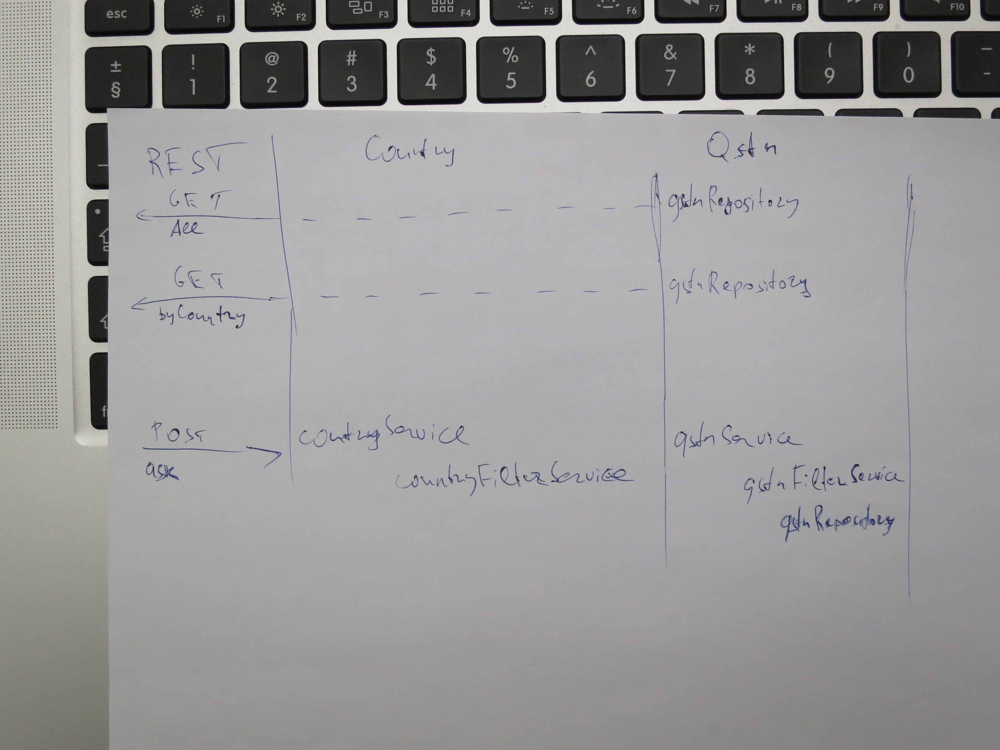
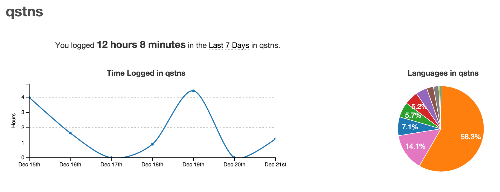
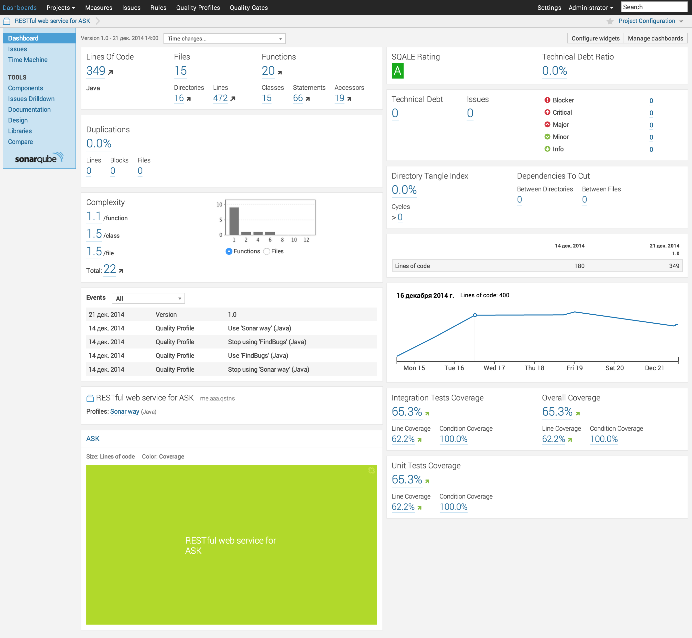

# Qstns
Simple ask qstns application

## Requirements
JRE 8
Maven

## Compile
Using maven: `mvn clean -Dmaven.test.skip=true install`  
_Because for cucumber test we need running application instance_

## Run
java -jar qstns-1.0-SNAPSHOT.jar

## Configuration
You can change configuration in `src/main/resources/application.yml`

Example configuration:

    qstns:
      defaultCountry: lv
      badWords:
        - brainfuck
        - brainsquueze
        - brainspin
      reqLimit: 1
      inTimeLimit: 1 #in sec

## Functionality
### Ask qstn
POST `/qstn`

    data:
      question: "What is the meaning of life?"

### Get all qstns
GET `/qstn`

### Get qstns by country
GET `/country/{country}`

## Example of json from get all qstns
        [
            {
                "id":1,
                "data":"I've been locked up! Somebody help me!",
                "country":"lv",
                "time":1419155611788,
                "status":"OK"
            },
            {
                "id":2,
                "data":"To be or not to be?",
                "country":"lv",
                "time":1419155627972,
                "status":"OK"
            },{
                "id":3,
                "data":"Cookies?",
                "country":"lv",
                "time":1419155656506,
                "status":"OK"
            }
        ]
## Screens (updated 21.12.2014 15:20)

